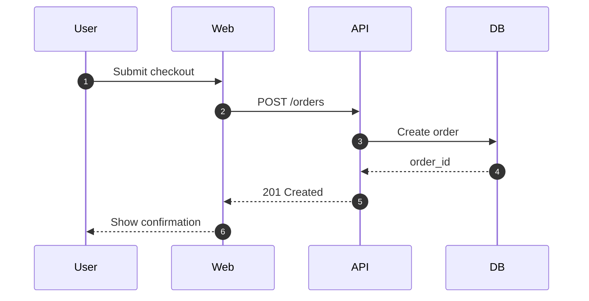
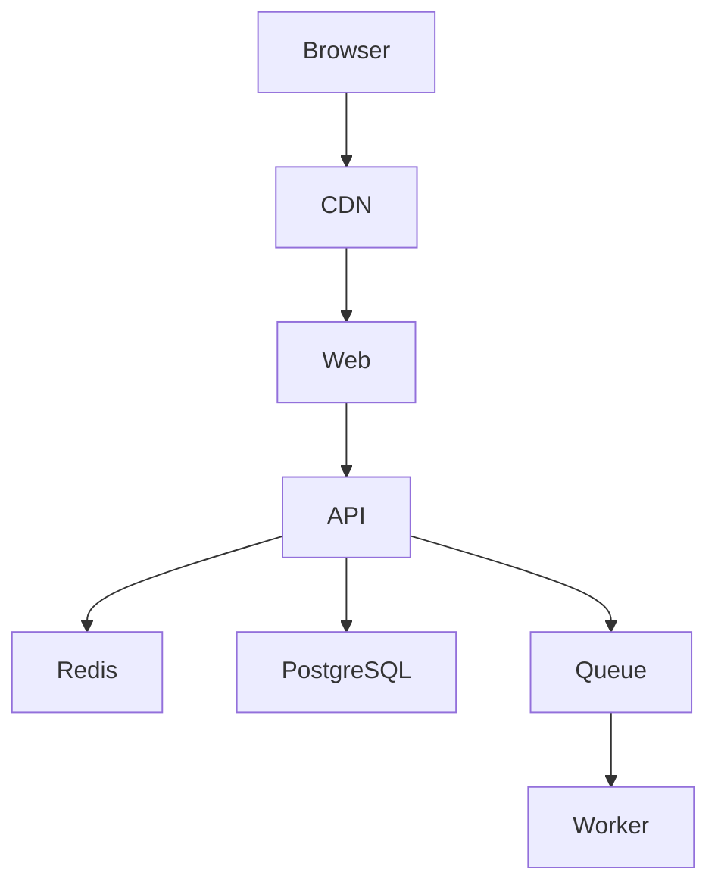

# English Launch Posts

Recommended polished version with screenshots: [recommended-posts.md](./recommended-posts.md).

Suggested screenshots:


## Hacker News Show HN

### Title Options

- Show HN: LLMs generate diagrams. I built the missing preview step
- Show HN: DiagramPreview - paste Mermaid/PlantUML/OpenAPI/SQL and export diagrams
- Show HN: A no-signup toolbox for previewing AI-generated technical diagrams
- Show HN: From AI-generated Mermaid to docs-ready SVG/PNG

### Post

I built DiagramPreview:

https://diagrampreview.com

Screenshots, if you want to preview the UI before opening it:

- Mermaid preview: `https://diagrampreview.com/marketing/images/desktop-mermaid-preview.png`
- AI Draw.io generator: `https://diagrampreview.com/marketing/images/desktop-ai-drawio-generator.png`

The problem I kept running into: LLMs are good at generating Mermaid, PlantUML, architecture notes, OpenAPI flows, SQL schemas, Docker Compose snippets, and Kubernetes manifests, but they usually stop at text. You still need to check whether the diagram renders and export it before it belongs in real docs.

DiagramPreview is meant to be the missing step between “AI generated some diagram text” and “this is ready for a README, design doc, PRD, or engineering proposal.”

Current tools include:

- Mermaid Preview
- PlantUML Preview
- Graphviz Preview
- D2 Preview
- Markdown Preview with Mermaid blocks
- AI Diagram Generator
- Text to Mermaid
- Mermaid AI Fixer
- OpenAPI to Sequence Diagram
- SQL to ER Diagram
- JSON / YAML / XML / CSV visualizers
- JSON Schema Visualizer
- Docker Compose Diagram
- Kubernetes Manifest Visualizer
- package.json Dependency Diagram
- Regex Railroad Diagram

It is browser-first and does not require an account. The core workflow is:

1. Paste generated or handwritten diagram/source text.
2. Preview it visually.
3. Fix syntax or structure issues.
4. Export SVG, PNG, or PDF when the renderer supports it.

I would love feedback from developers who write documentation, architecture notes, API specs, or AI-assisted technical docs.

## Dev.to / Hashnode

### Title Options

- Preview AI-generated Mermaid and PlantUML before adding them to docs
- How I turn LLM-generated Mermaid into docs-ready diagrams
- A practical workflow for AI-generated diagrams: preview, fix, export

### Post

LLMs are now very good at generating Mermaid, PlantUML, OpenAPI flows, SQL schemas, Docker Compose snippets, and Kubernetes manifests.

But there is still a practical gap in the workflow:

- The model gives you diagram text.
- You still need to preview it.
- You often need to fix small syntax errors.
- You need SVG/PNG/PDF export before adding it to a README, design doc, or proposal.

For example, an LLM can generate a Mermaid sequence diagram like this:



That is a good draft, but I still want to check whether it renders, whether the labels are readable, and whether the exported SVG looks clean in the final document.

The same thing happens with API and DevOps docs. The source might be YAML instead of Mermaid:

```yaml
paths:
  /orders:
    post:
      summary: Create order
      responses:
        "201":
          description: Order created
        "401":
          description: Missing or invalid token
        "422":
          description: Invalid order payload
```

Or a Prometheus alert rule:

```yaml
groups:
  - name: api.rules
    rules:
      - alert: HighApiErrorRate
        expr: sum(rate(http_requests_total{status=~"5.."}[5m])) / sum(rate(http_requests_total[5m])) > 0.05
        for: 10m
        labels:
          severity: warning
```

I built DiagramPreview to cover that missing step:

https://diagrampreview.com

Here is what the preview workflow looks like:


The workflow is simple:

1. Ask an LLM to generate a Mermaid, PlantUML, or architecture diagram.
2. Paste the result into DiagramPreview.
3. Preview the rendered output.
4. Fix syntax issues if needed.
5. Export it for documentation.

I also like keeping both the source and the rendered output in the repository:

```text
docs/
  architecture/
    checkout-sequence.mmd
    checkout-sequence.svg
  observability/
    api-alert-rules.yaml
    api-dashboard.json
```

That way the diagram remains editable instead of becoming a one-off screenshot.

It currently supports Mermaid, PlantUML, Graphviz, D2, Markdown with Mermaid, OpenAPI to sequence diagrams, SQL to ER diagrams, JSON/YAML/XML/CSV visualizers, JSON Schema, Docker Compose, Kubernetes manifests, package.json dependencies, and regex railroad diagrams.

It also includes AI-assisted tools such as AI Draw.io generation and Grafana dashboard JSON generation:


The goal is not to replace AI. It is to make AI-generated diagram output easier to validate, edit, and ship into real documentation.

## Indie Hackers

### Title Options

- I built a small diagram preview toolbox because LLMs stop at text
- Turning a repeated AI documentation workflow into a small developer tool
- Building DiagramPreview: preview, fix, and export AI-generated diagrams

### Post

I have been building DiagramPreview:

https://diagrampreview.com

Current UI:


The idea came from a repeated workflow: I ask an LLM to generate a Mermaid or PlantUML diagram, then I need another tool to preview it, fix syntax issues, and export it before using it in docs.

So I turned that middle step into a browser-first toolbox for developers. It supports Mermaid, PlantUML, Graphviz, D2, OpenAPI, SQL ER, JSON/YAML/XML/CSV visualizers, Docker Compose, Kubernetes, package.json dependency diagrams, and a few AI-assisted tools.

The tools are grouped by use case so the header does not become one long flat menu:


The positioning is: preview, fix, and export AI-generated diagrams.

I am still early and looking for feedback on which formats to support next. I am considering draw.io generation, PlantUML to draw.io, Grafana dashboard generation, Prometheus alert rules, DBML, Terraform, Protobuf, AsyncAPI, and GitHub Actions workflow diagrams.

## Medium

### Title Options

- The missing preview step in AI-generated diagrams
- AI can write Mermaid. Your docs still need a rendered diagram.
- From generated diagram text to documentation-ready visuals

### Post

AI has made it much easier to generate technical diagrams. A model can draft Mermaid flowcharts, PlantUML sequence diagrams, architecture notes, OpenAPI flows, SQL schema relationships, Docker Compose service maps, and Kubernetes summaries.

But AI-generated diagram text still needs a practical handoff step before it becomes usable documentation.

You need to preview it. You need to catch syntax errors. You need to export it as SVG, PNG, or PDF. Sometimes you need to turn it into an editable artifact that fits an existing documentation workflow.

Here is a simple example. This Mermaid source is useful, but it is not “done” until someone checks the rendered output:



For infrastructure docs, the input may be Docker Compose:

```yaml
services:
  web:
    image: example/web:1.0
    depends_on:
      - api
  api:
    image: example/api:1.0
    depends_on:
      - postgres
      - redis
  postgres:
    image: postgres:16
  redis:
    image: redis:7
```

In both cases, the important step is the same: turn text into a preview, inspect the relationships, then export or keep the editable source.

That is the gap DiagramPreview is designed for:

https://diagrampreview.com

Product screenshots:


It is a browser-first toolbox for developers and technical writers who use AI-assisted documentation workflows. Paste the generated text, preview it visually, fix issues, and export a clean asset.

## Product Hunt

### Tagline

Preview, fix, and export AI-generated diagrams.

### First Comment

Hi Product Hunt,

I built DiagramPreview for a workflow I kept repeating: ask an AI tool to generate a Mermaid, PlantUML, architecture, OpenAPI, SQL, Docker Compose, or Kubernetes diagram, then find another tool to preview and export it.

Screenshots:


DiagramPreview focuses on the missing middle step between AI-generated text and production-ready documentation:

- Paste diagram/source text
- Preview visually
- Fix syntax or structure issues
- Export SVG, PNG, or PDF

It is browser-first and does not require an account. I would love feedback from developers, technical writers, and teams using AI to write documentation.
