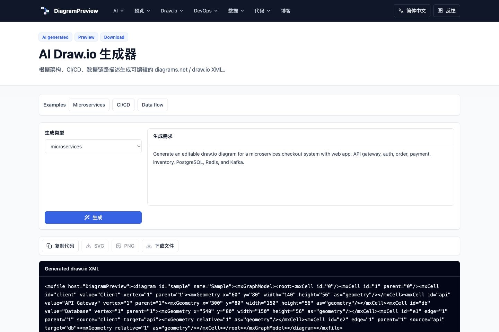
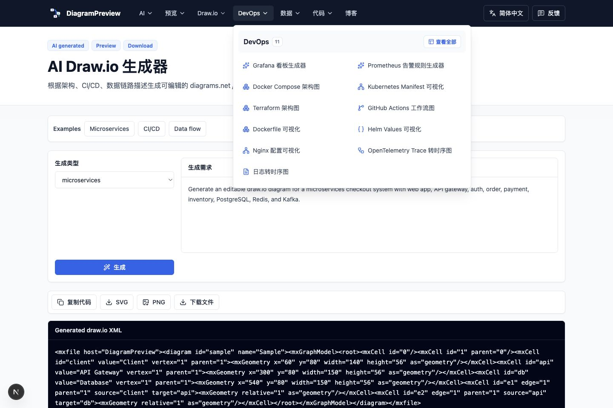

# Chinese Launch Posts

Recommended polished version with screenshots: [recommended-posts.md](./recommended-posts.md).

Suggested screenshots:

## V2EX

### Title Options

- 做了一个在线图表预览工具：主要解决 AI 生成 Mermaid/PlantUML 后没法直接预览的问题
- 分享一个小工具：把 AI 生成的 Mermaid、PlantUML、OpenAPI、SQL 直接预览成图
- AI 现在很会写 Mermaid，但预览和导出还是麻烦，所以做了 DiagramPreview

### Post

大家好，最近我做了一个小工具 DiagramPreview：

https://diagrampreview.com

起因是我现在写技术文档时，经常让大模型生成 Mermaid、PlantUML、架构图、OpenAPI 流程、SQL ER 图之类的文本。但大模型通常只给代码，不提供稳定的预览、导出、语法修复和多格式工作流。

所以我把这个中间步骤做成了一个在线工具站：

- Mermaid / PlantUML / Graphviz / D2 / Markdown 预览
- AI Diagram Generator、Text to Mermaid、Mermaid AI Fixer
- OpenAPI to Sequence Diagram、SQL to ER Diagram
- JSON / YAML / JSON Schema / XML / CSV 结构可视化
- Docker Compose、Kubernetes Manifest、package.json 依赖图
- SVG / PNG / PDF 导出
- 不需要登录，浏览器里直接用

我的主要使用场景是：

1. 让 AI 先生成图表代码。
2. 粘贴到 DiagramPreview 里看是否能渲染。
3. 如果语法坏了，修一下或让 AI 修复。
4. 导出 SVG/PNG 放到 README、PRD、技术方案或周报里。

目前还比较早期，想听听 V2EX 上大家的建议：

- 你们写技术文档时最常用 Mermaid、PlantUML 还是 draw.io？
- 还有哪些格式值得补，比如 DBML、Terraform、Protobuf、Grafana Dashboard、Prometheus Alert、Swagger 更深度可视化？
- 工具站这种形态，你会希望更偏“编辑器”，还是更偏“格式转换集合”？

欢迎拍砖，我会继续迭代。

## 掘金

### Title

AI 生成 Mermaid 后，如何预览、修复并导出到技术文档？

### Post

现在很多人写技术文档时，会先让 AI 生成 Mermaid、PlantUML、架构图说明、OpenAPI 调用流程、SQL ER 图，甚至 Docker Compose 和 Kubernetes 关系图。

这个流程很爽，但有一个问题一直存在：AI 给你的通常只是代码。

比如它可以生成一段 Mermaid：

- 你还要找地方预览。
- 语法错了要自己定位。
- 要放进 README 或设计文档时，还得导出 SVG/PNG。
- 多种格式之间切换时，工具比较零散。

所以我做了一个在线工具站 DiagramPreview：

https://diagrampreview.com

它的定位不是替代 AI，而是补上 AI 输出之后的“预览、校验、导出”环节。

目前支持：

- Mermaid Preview
- PlantUML Preview
- Graphviz Preview
- D2 Preview
- Markdown Preview with Mermaid
- AI Diagram Generator
- Text to Mermaid
- Mermaid AI Fixer
- OpenAPI to Sequence Diagram
- SQL to ER Diagram
- JSON / YAML / XML / CSV 可视化
- JSON Schema Visualizer
- Docker Compose Diagram
- Kubernetes Manifest Visualizer
- package.json Dependency Diagram
- Regex Railroad Diagram

我现在自己的工作流是：

1. 让 AI 根据需求生成 Mermaid 或 PlantUML。
2. 粘贴到 DiagramPreview 里预览。
3. 如果语法坏了，用修复工具或继续让 AI 改。
4. 导出 SVG/PNG/PDF，放到 README、技术方案、PRD 或博客里。

如果你经常写技术文档、接口设计、架构说明，或者经常让 AI 生成图表，可以试试。也欢迎反馈还应该补哪些格式。

## 博客园 / CSDN / SegmentFault

### Title Options

- Mermaid 在线预览与导出：AI 生成流程图后的完整工作流
- PlantUML、Mermaid、SQL ER 图在线预览工具整理
- 技术文档图表怎么做：从 AI 生成到 SVG/PNG 导出

### Post

最近写技术文档时，我越来越频繁地让 AI 生成流程图、架构图、时序图和数据结构说明。

比如让它生成：

- Mermaid flowchart
- PlantUML sequence diagram
- OpenAPI 接口调用流程
- SQL ER 图
- Docker Compose 服务关系
- Kubernetes manifest 摘要
- package.json 依赖关系

问题是，大模型通常只给文本代码。它可以写 Mermaid，但不会稳定地帮你预览；它可以写 PlantUML，但你还要找地方渲染；它可以解释 OpenAPI 或 SQL，但你还是要手动整理成图。

于是我做了 DiagramPreview：

https://diagrampreview.com

它想解决的是 AI 生成图表后的下一步：

1. 粘贴 AI 生成的图表代码。
2. 在线预览是否能渲染。
3. 如果 Mermaid 语法有问题，可以修复。
4. 生成 SVG/PNG/PDF，放进 README、技术方案、PRD 或博客。

这个工具站的定位不是替代 AI，而是补上 AI 输出和正式文档之间的“预览、校验、导出”环节。

适合搜索关键词：

- Mermaid 在线预览
- PlantUML 在线预览
- Mermaid 导出 SVG
- PlantUML 导出 PNG
- SQL ER 图在线生成
- OpenAPI 时序图
- AI 生成流程图预览

## 知乎

### Question Angle

AI 生成流程图后如何预览和导出？

### Answer

我自己的做法是把 AI 和预览工具拆开：

AI 负责生成第一版图表文本，比如 Mermaid、PlantUML、OpenAPI 调用流程、SQL 表结构关系等；预览工具负责把这段文本渲染出来，确认图是否正确，再导出 SVG/PNG 放进文档。

这个方式比完全依赖 AI 更稳，因为大模型生成的 Mermaid 经常会有一些小语法问题。如果直接复制到 README 或文档系统里，等到渲染失败才发现会比较麻烦。

我做了一个小工具 DiagramPreview：

https://diagrampreview.com

主要就是解决 paste -> preview -> fix -> export 这个流程。现在支持 Mermaid、PlantUML、Graphviz、D2、OpenAPI、SQL ER、JSON/YAML/XML/CSV 可视化、Docker Compose、Kubernetes Manifest、package.json 依赖图等。

如果你的场景是写技术方案、README、接口文档、架构设计，或者经常让 AI 生成图表代码，这种工具会比较省时间。

## 开源中国

### Title

分享一个面向开发者的在线图表预览工具：DiagramPreview

### Post

最近做了一个在线工具站 DiagramPreview：

https://diagrampreview.com

主要面向开发者文档场景，解决 AI 生成 Mermaid、PlantUML、OpenAPI、SQL ER、Docker Compose、Kubernetes 等文本之后缺少预览和导出的问题。

目前支持 Mermaid、PlantUML、Graphviz、D2、Markdown、JSON/YAML/XML/CSV 可视化、JSON Schema、SQL ER、OpenAPI 时序图、Docker Compose Diagram、Kubernetes Manifest Visualizer、package.json Dependency Diagram 等。

不需要登录，浏览器里直接使用。欢迎试用，也欢迎反馈还应该支持哪些开发者常用格式。
