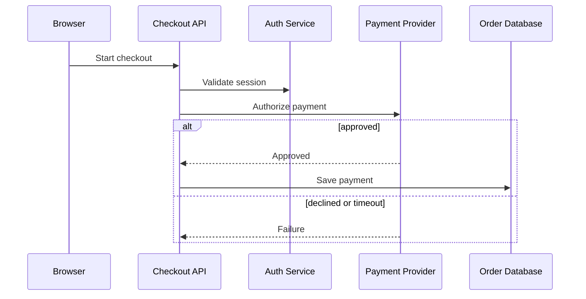

# AI-generated Mermaid workflow fixture

## Before

`input.txt` is a constrained prompt for a checkout sequence diagram. Open it with [Text to Mermaid](https://diagrampreview.com/en/text-to-mermaid), then review the generated source in [Mermaid Preview](https://diagrampreview.com/en/mermaid-preview).

## Expected result

The output should contain only the five required actors, separate approved, declined, and timeout paths, and short message labels. Keep the Mermaid source beside the exported SVG or draw.io file.

## Failure cases

- Invented systems that were not in the prompt.
- One success-only flow with no declined or timeout branch.
- Long labels that become unreadable in a README.
- Exporting without checking the generated Mermaid source.

## README handoff

Commit the `.mmd` source and exported SVG together. Link back to the source so reviewers can update the diagram instead of editing a screenshot.

Next tools: [Mermaid AI Fixer](https://diagrampreview.com/en/mermaid-ai-fixer) and [Mermaid to draw.io](https://diagrampreview.com/en/mermaid-to-drawio).
